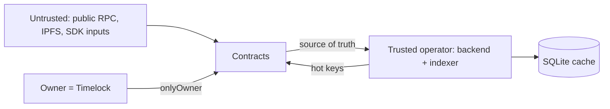

# Threat model

Scope: the TAOP pilot as deployed (Base Sepolia today; the same shape on mainnet).
Companion to [`SECURITY-REVIEW.md`](SECURITY-REVIEW.md),
[`EMERGENCY.md`](EMERGENCY.md), [`SECURITY.md`](../SECURITY.md).

## Assets

| Asset | Where | Impact if compromised |
|---|---|---|
| Challenge bonds + slashed pools (ETH) | `ReputationOracleNetwork`, `CapabilityRegistry` | Direct loss of user/creator funds |
| Owner rights (resolve, withdraw, setCertifier) | `TimelockController` | Adjudicate fraud arbitrarily, move pools |
| Certifier rights (certify/slash) | `certifier` address | Certify fake models, slash honest bonds |
| Reputation scores / capability index | On-chain state | Sybil/poison the signal the product sells |
| `AGENT_A_PK`, `DEPLOYER_PK` | `.env` / host | Impersonate the demo agent; owner takeover |
| `TAOP_API_KEY` | server env | Trigger writes (spend bonds, pin IPFS) |
| Off-chain index + SQLite | backend host | Stale/wrong discovery (non-authoritative) |

## Actors

- **Agent** — self-attests completions; can contest challenges.
- **Requester / counterparty** — countersigns (receipts) and revokes.
- **Challenger** — posts a bond to allege fraud.
- **Owner** (Timelock) and **certifier** — privileged roles.
- **Operator** — runs the backend/indexer; holds hot keys.
- **Attacker** — external, and potentially a colluding agent+requester pair.

## Trust boundaries

- Contracts are the source of truth and validate all inputs.
- The **owner is the Timelock**; at the pilot it is 0-delay, single-EOA — effectively
  one key (mainnet requires a multisig + delay).
- The **backend is trusted** (hot keys, spends bonds, pins IPFS) and must stay
  private; only the read-only instance is public.
- The **indexer is non-authoritative** (rebuildable; reorg-aware; discovery falls
  back to direct reads).
- **Public RPC / IPFS** are untrusted transports — integrity comes from on-chain
  verification, not the transport.

## Threats and mitigations

| # | Threat | Mitigation | Residual |
|---|---|---|---|
| T1 | Fraudulent self-attestation | Two-sided receipts + challenge bonds + owner adjudication; **v0.3: ranking on distinct counterparties + attest cooldown** | Collusion still possible; diversity makes it far less profitable |
| T2 | Fake/malicious capability | Certifier gate + slashable bond | Certifier is one key/EOA |
| T3 | Unauthorized admin action | `onlyOwner` via Timelock; multisig + delay before mainnet | Pilot: single-key, **0-delay** |
| T3b | Exploit/bug draining an active flow | **v0.3: owner can pause** protocol actions (exits stay open) | Pause is a centralization trust point (Timelock) |
| T4 | Reentrancy / ETH drain | `nonReentrant`, checked `.call{value}`; invariants assert ETH conservation | Low; fuzz/invariants cover |
| T5 | Stale discovery index | Reorg-aware indexer; on-chain fallback; ETag | Cache trust (non-authoritative) |
| T6 | Spam / griefing (attest, challenge) | Bond + rate limits on writes | Bonds may be too low on mainnet |
| T7 | Key compromise (agent/owner) | Separate keys; cold owner; rotation runbook | Owner single-key today |
| T8 | Leaked secret to Git | Secret scanning + push protection; `.gitignore`; history purge | Dangling GitHub blob (Support GC) |
| T9 | Backend exposed publicly | Loopback default; `X-TAOP-Key`; refuse public bind w/o key; `DEMO_READ_ONLY` | Operator error |
| T10 | Dependency supply chain | Dependabot + `npm audit`/`pip-audit`; lockfile; pinned Actions | Fresh-package policy disabled for build |

## Out of scope / accepted today

- **No pause / circuit breaker** — a bug cannot be frozen post-deploy; response is
  rotate + migrate (`EMERGENCY.md`). Decision to add one is pending.
- **No external audit** — internal review only.
- **No on-chain identity** — addresses only; sybil resistance is economic.
- **No upgradeability** — fixes require redeploy + migration.

## Assumptions

- Base L2 liveness/finality as provided; reorgs bounded by indexer confirmations.
- IPFS content addressing; pin availability best-effort.
- The operator secures the backend host and its `.env`.

## Review cadence

Re-run `SECURITY-REVIEW.md` (Slither + Aderyn + mutation) and revisit this document
whenever privileges, bonds, the trust model, or the deployment target change.
