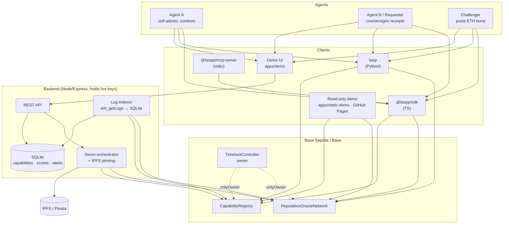
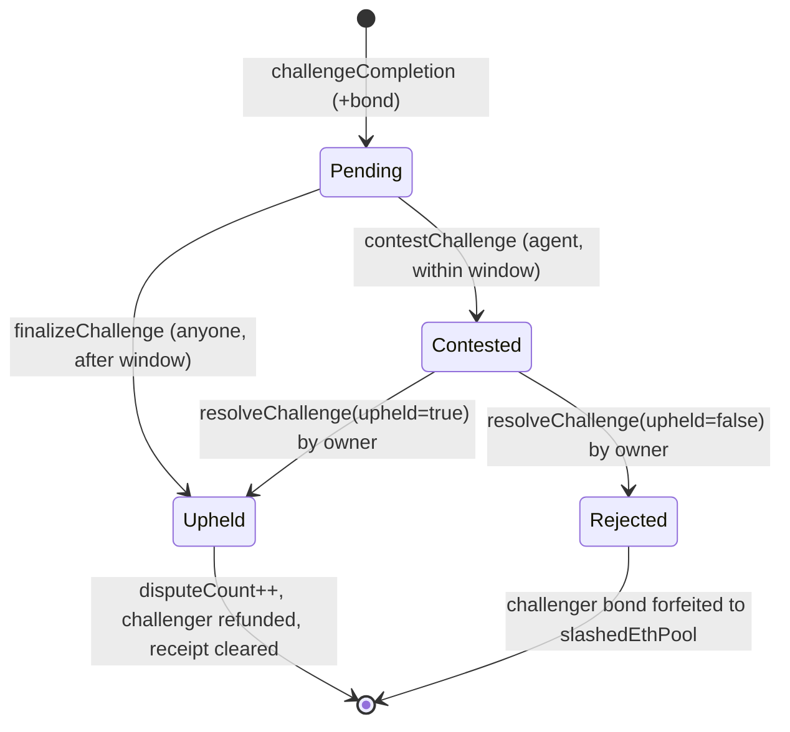

# Architecture

TAOP is two on-chain contracts on Base plus a thin set of clients. On-chain truth
is the source of record; everything else is a cache or a view.

## System overview



## Two-sided lifecycle (v0.2)

```mermaid
sequenceDiagram
    autonumber
    participant A as Agent A
    participant R as Requester
    participant C as Challenger
    participant O as Owner (Timelock)
    participant RON as ReputationOracleNetwork

    A->>RON: attestCompletion(taskType, resultCID)
    R->>RON: attestReceipt(completionId, receiptCID)
    Note over RON: confirmedCount++ → two-sided score
    R-->>RON: revokeReceipt (optional)
    C->>RON: challengeCompletion{0.01 ETH}
    Note over RON: opens CHALLENGE_WINDOW (3 days)
    alt Agent rebuts in time
        A->>RON: contestChallenge(completionId, rebuttalCID)
        O->>RON: resolveChallenge(upheld)
    else Agent stays silent
        C->>RON: finalizeChallenge(completionId)  (permissionless, after window)
        Note over RON: upheld optimistically; receipt invalidated
    end
```

## Challenge state machine



## Trust boundaries

- **On-chain truth:** scores, bonds, dispute state, capability index. Discovery
  reads it directly or via the index.
- **Owner = TimelockController.** At the pilot it is 0-delay, single-EOA
  proposer/executor; mainnet requires a multisig + non-zero delay
  (`hardened-timelock.md`).
- **Backend = trusted operator.** Holds hot keys and can spend bonds / pin to
  IPFS — run it privately (`TAOP_API_KEY`, loopback) and expose only the
  read-only instance (`DEMO_READ_ONLY=true`).
- **Indexer = rebuildable cache.** Never authoritative; reorg-aware and
  reconstructible from logs. `/api/discover` falls back to direct chain reads.

See [`SECURITY-REVIEW.md`](SECURITY-REVIEW.md), [`EMERGENCY.md`](EMERGENCY.md)
and [`OPERATIONS.md`](OPERATIONS.md).
